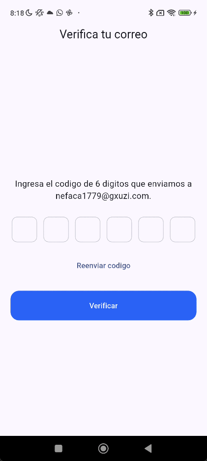
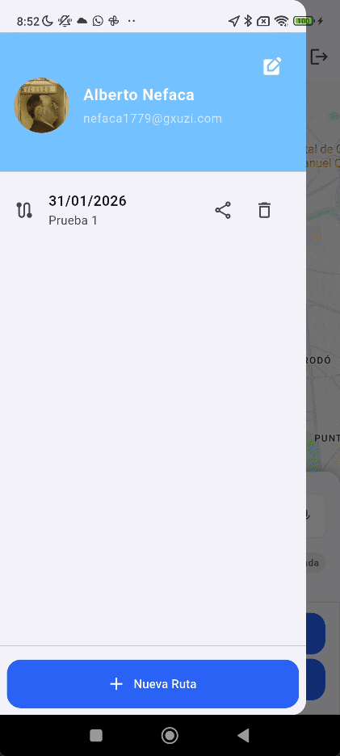
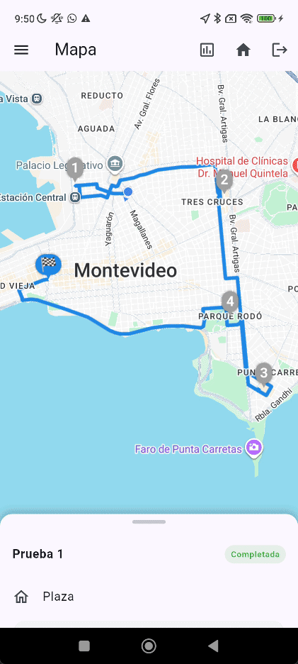
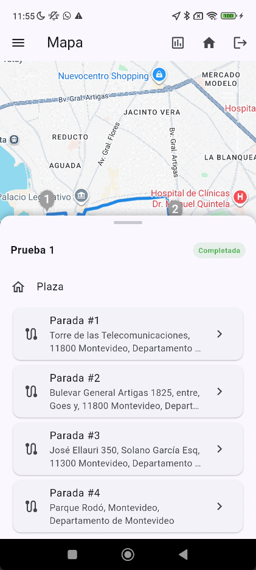

# Manual de Usuario - Smart Route App

## Objetivo

Smart Route App ayuda a planificar y ejecutar rutas con paradas, optimizar el orden, registrar el estado de cada parada y gestionar paquetes.

## Requisitos

- Cuenta activa (correo y contrasena).
- Conexion a internet para mapas y servicios.
- Permisos recomendados: ubicacion, microfono (busqueda por voz), camara y galeria (fotos de paquetes).
- Una app de mapas instalada para navegacion externa.

## Primer ingreso

1. Crear cuenta en **Registro**.
2. Verificar el correo desde la pantalla de verificacion.
3. Iniciar sesion con correo y contrasena.

## Pantalla principal (Mapa)

- Muestra el mapa y las rutas disponibles.
- Abajo se ve el panel de ruta (paradas y acciones).
- Si no hay una ruta seleccionada, aparece el boton **Nueva Ruta**.

## Menu lateral

Desde el icono de menu:

- Ver perfil y editar datos del usuario.
- Ver lista de rutas con fecha y nombre.
- Compartir una ruta (genera un enlace).
- Eliminar una ruta.
- Crear una nueva ruta.

## Direcciones de retorno

- En el mapa, usa el boton de **Direccion de retorno** (icono de casa).
- Puedes agregar, editar o eliminar direcciones.
- Se seleccionan como retorno al crear una ruta.

## Crear una ruta

1. Toca **Nueva Ruta**.
2. Completa **Nombre de la ruta**.
3. Selecciona **Fecha**.
4. Opcional: elige una **Direccion de retorno**.
5. Presiona **Crear ruta**.

## Agregar paradas

- En el panel de ruta, toca el campo para buscar direccion.
- Puedes usar el microfono para dictar una direccion.
- Selecciona un resultado para empezar a crear la parada.

## Ver y editar una parada

1. Selecciona una parada en la lista.
2. En **Editar parada** puedes:
   - Cambiar el tipo: **Entrega** o **Recogida**.
   - Ajustar **Hora de llegada**.
   - Agregar **Descripcion**.
   - Cambiar direccion.
   - Eliminar parada.
3. Guarda los cambios con **Guardar**.

## Paquetes (solo en paradas de Entrega)

- En **Paquetes asignados** puedes:
  - Agregar paquete con descripcion, peso y foto.
  - Editar o eliminar paquetes.
  - Ver detalle del paquete.

## Optimizar ruta

- Si la ruta esta en estado **Planificada**, toca **Optimizar**.
- Si activas **Optimizar paradas**, se creara una ruta con un recorrido optimo, de lo contrario desmarca la opcion para mantener el orden de las paradas ingresadas.

## Navegacion a una parada

- En la vista de parada activa, toca el boton de navegacion.
- Elige la app de mapas instalada para abrir la ubicacion.

## Ejecutar una ruta

- **Iniciar Ruta**:
- En una parada, puedes marcar:
  - **Exitosa**
  - **Fallida**
- **Finalizar Ruta**: cierra la ruta cuando termina.
- La parada pintada de azul en el mapa representa la proxima parada a visitar, mientras que las grises representan las ya visitadas.

## Reportes

- Toca el icono de **Reportes** en la barra superior.
- Selecciona **Rango de fechas**, **Tipo de paquete** y **Tipo de documento**.
- Confirma para generar el reporte.

## Compartir ruta

- En el menu lateral, toca el icono de **Compartir** en una ruta.
- Se genera un enlace que puede abrirse desde el dispositivo receptor.

## Cerrar sesion

- En la barra superior, toca el icono de **Cerrar sesion** y confirma.

